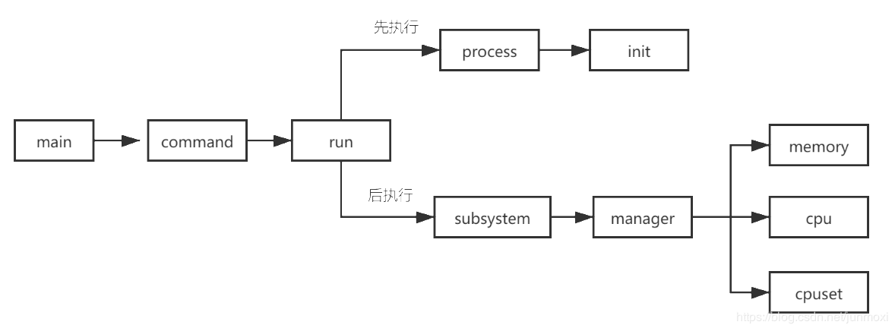

# miniDocker
miniDocker实现Docker基本功能

Docker本质其实是一个特殊的进程，这个进程被`Linux`中`Namespace`和`Cgroup`技术做了装饰，`NameSpace`将该进程与`Linux`系统进行隔离开来，而`Cgroup`则对该进程做了一系列的资源限制，两者配合模拟出来一个沙盒的环境。

## 创建容器主要流程

1. `main` 主要加载了runCommand和initCommand两个命令
   - runCommand命令中为run命令，包含ti（是否前台显示）、memory（内存设置）、cpu（cpu设置）、cpuset（cpuset 用于限制一组进程只运行在特定的 cpu 节点上和只在特定的 mem 节点上分配内存）等参数。
   - initCommand命令中为init命令。

2. `command` 中主要定义了runCommand和initCommand两个命令
   - runCommand命令收集参数调用`run`中Run方法
   - initCommand命令调用`init`中RunContainerInitProcess方法
3. `run` 中Run方法首先创建一个新的隔离进程，然后设置cgroup资源限制，最后将传递过来的命令参数写入到writePipe
4. `process`中的NewParentProcess就是创建新隔离进程的方法并适用init参数调用了initCommand命令
5. `init`中RunContainerInitProcess方法就是读取参数，设置联合文件系统并挂载到proc下
6. `subsystem`中使用工厂模式定义了设置资源限制的方法
7. `manager`遍历subsystem中的集合并进行资源限制
